# 🚀 SUPER PROJETO DE IMPLEMENTAÇÃO
## Sistema Completo de Agente IA Multi-Cliente com Integrações Avançadas

> **Data:** 24 de junho de 2025  
> **Versão:** 2.0 - Implementação Completa  
> **Status:** Especificação Técnica Final

---

## 📋 ÍNDICE

1. [Visão Geral do Sistema](#visão-geral-do-sistema)
2. [Arquitetura Dual IA](#arquitetura-dual-ia)
3. [Sistema Multi-Cliente](#sistema-multi-cliente)
4. [Conectores e Integrações](#conectores-e-integrações)
5. [Criação Automática de Plugins](#criação-automática-de-plugins)
6. [Fluxos de Implementação](#fluxos-de-implementação)
7. [Prompts Contextuais](#prompts-contextuais)
8. [Segurança e Credenciais](#segurança-e-credenciais)
9. [Interface CLI Avançada](#interface-cli-avançada)
10. [Exemplos Práticos](#exemplos-práticos)
11. [Roadmap de Implementação](#roadmap-de-implementação)

---

## 🎯 VISÃO GERAL DO SISTEMA

### Conceito Principal
**Agente IA Construtor** que cria, instala, ativa e configura plugins WordPress automaticamente, com sistema dual de IA (Claude para código/sistemas + OpenAI para conteúdo/textos), suporte multi-cliente e integrações com serviços externos.

### Características Principais

```
🧠 DUAL IA
├── Claude (Sistemas/Código)
├── OpenAI (Conteúdo/Textos)
└── Escolha Inteligente Automática

🏢 MULTI-CLIENTE
├── Credenciais Isoladas
├── Contexto por Cliente
├── Conectores Dinâmicos
└── Gestão Centralizada

🔌 PLUGINS AUTOMÁTICOS
├── Criação Inteligente
├── Instalação SSH/WP-CLI
├── Ativação Automática
└── Configuração Contextual

🌐 INTEGRAÇÕES EXTERNAS
├── Google Calendar/Gmail
├── Stripe/PayPal
├── WhatsApp/SMS
├── CRMs/ERPs
└── APIs Customizadas
```

---

## 🧠 ARQUITETURA DUAL IA

### Sistema de Escolha Inteligente

```javascript
// src/core/ai-router.js
class AIRouter {
  static chooseAI(taskType, content) {
    const claudeTasks = [
      'code', 'system', 'plugin', 'integration', 
      'database', 'security', 'architecture'
    ];
    
    const openaiTasks = [
      'content', 'text', 'copy', 'blog', 
      'marketing', 'description', 'email'
    ];
    
    // Análise de contexto
    if (claudeTasks.some(task => taskType.includes(task))) {
      return 'claude';
    }
    
    if (openaiTasks.some(task => taskType.includes(task))) {
      return 'openai';
    }
    
    // Análise de conteúdo
    const codePatterns = /(?:function|class|<?php|javascript|css|sql)/i;
    if (codePatterns.test(content)) {
      return 'claude';
    }
    
    return 'openai'; // Default para textos
  }
  
  static async askWithBestAI(prompt, taskType, systemPrompt) {
    const aiChoice = this.chooseAI(taskType, prompt);
    
    if (aiChoice === 'claude') {
      return await askClaude(prompt, systemPrompt);
    } else {
      return await askOpenAI(prompt, systemPrompt);
    }
  }
}
```

### Prompts Especializados por IA

```javascript
const AI_PROMPTS = {
  claude: {
    plugin_creation: `
Você é um especialista em desenvolvimento de plugins WordPress.
Crie código PHP robusto, seguro e otimizado.
Inclua:
- Estrutura OOP moderna
- Hooks e filters apropriados
- Segurança (nonces, sanitização)
- Documentação inline
- Padrões WordPress
`,
    
    integration_code: `
Você é um especialista em integrações de APIs e sistemas.
Crie código que:
- Gerencie credenciais de forma segura
- Implemente retry logic e error handling
- Use padrões de design apropriados
- Seja facilmente extensível
`,
    
    system_architecture: `
Você é um arquiteto de sistemas.
Projete soluções que sejam:
- Escaláveis e maintíveis
- Seguem melhores práticas
- Performance otimizada
- Documentação técnica clara
`
  },
  
  openai: {
    content_creation: `
Você é um redator especialista em conteúdo digital.
Crie textos que sejam:
- Engajantes e persuasivos
- Otimizados para SEO
- Apropriados para o público-alvo
- Com tom e linguagem adequados
`,
    
    marketing_copy: `
Você é um especialista em copywriting e marketing.
Crie conteúdos que:
- Gerem conversões
- Conectem emocionalmente
- Tenham CTAs efetivos
- Sigam frameworks comprovados
`,
    
    user_communication: `
Você é um comunicador expert.
Crie mensagens que sejam:
- Claras e diretas
- Empáticas e humanizadas
- Orientadas à ação
- Contextualmente apropriadas
`
  }
};
```

---

## 🏢 SISTEMA MULTI-CLIENTE

### Estrutura de Clientes

```javascript
// src/core/client-manager.js
class ClientManager {
  constructor() {
    this.clientsPath = path.join(__dirname, '../../config/clients');
    this.encryptionKey = process.env.ENCRYPTION_KEY;
  }
  
  async createClient(clientData) {
    const client = {
      id: this.generateClientId(),
      name: clientData.name,
      sites: clientData.sites || [],
      credentials: await this.encryptCredentials(clientData.credentials),
      integrations: clientData.integrations || {},
      preferences: clientData.preferences || {},
      created_at: new Date().toISOString(),
      updated_at: new Date().toISOString()
    };
    
    await this.saveClient(client);
    await this.createClientDirectories(client.id);
    
    return client;
  }
  
  async getClientCredentials(clientId, service) {
    const client = await this.getClient(clientId);
    const decryptedCreds = await this.decryptCredentials(client.credentials);
    return decryptedCreds[service];
  }
  
  async updateClientIntegration(clientId, service, config) {
    const client = await this.getClient(clientId);
    client.integrations[service] = config;
    client.updated_at = new Date().toISOString();
    
    await this.saveClient(client);
    return client;
  }
}
```

### Configuração por Cliente

```json
// config/clients/client-abc123.json
{
  "id": "abc123",
  "name": "Agência Fer",
  "sites": [
    {
      "domain": "agenciafer.com.br",
      "wp_path": "/domains/agenciafer.com.br/public_html",
      "ssh_config": {
        "host": "147.93.37.192",
        "port": 65002,
        "user": "u148368058"
      }
    }
  ],
  "credentials": {
    "google": {
      "client_id": "encrypted_data",
      "client_secret": "encrypted_data",
      "service_account": "encrypted_json"
    },
    "stripe": {
      "public_key": "encrypted_data",
      "secret_key": "encrypted_data",
      "webhook_secret": "encrypted_data"
    },
    "openai": {
      "api_key": "encrypted_data"
    },
    "whatsapp": {
      "token": "encrypted_data",
      "verify_token": "encrypted_data"
    }
  },
  "integrations": {
    "google_calendar": {
      "enabled": true,
      "calendar_id": "primary",
      "timezone": "America/Sao_Paulo"
    },
    "stripe_payments": {
      "enabled": true,
      "currency": "BRL",
      "webhook_url": "https://agenciafer.com.br/webhook/stripe"
    }
  },
  "preferences": {
    "default_ai": "auto",
    "language": "pt-BR",
    "timezone": "America/Sao_Paulo"
  }
}
```

---

## 🔌 CONECTORES E INTEGRAÇÕES

### Conectores Dinâmicos

```javascript
// src/connectors/base-connector.js
class BaseConnector {
  constructor(clientId) {
    this.clientId = clientId;
    this.clientManager = new ClientManager();
  }
  
  async getCredentials(service) {
    return await this.clientManager.getClientCredentials(this.clientId, service);
  }
  
  async authenticate() {
    throw new Error('authenticate() deve ser implementado pela classe filha');
  }
  
  async testConnection() {
    throw new Error('testConnection() deve ser implementado pela classe filha');
  }
}

// src/connectors/google-connector.js
class GoogleConnector extends BaseConnector {
  async authenticate() {
    const creds = await this.getCredentials('google');
    
    this.auth = new google.auth.GoogleAuth({
      credentials: JSON.parse(creds.service_account),
      scopes: [
        'https://www.googleapis.com/auth/calendar',
        'https://www.googleapis.com/auth/gmail.modify'
      ]
    });
    
    return this.auth;
  }
  
  async createCalendarEvent(eventData) {
    const auth = await this.authenticate();
    const calendar = google.calendar({ version: 'v3', auth });
    
    const event = {
      summary: eventData.title,
      start: {
        dateTime: eventData.start,
        timeZone: 'America/Sao_Paulo'
      },
      end: {
        dateTime: eventData.end,
        timeZone: 'America/Sao_Paulo'
      },
      description: eventData.description,
      attendees: eventData.attendees || []
    };
    
    return await calendar.events.insert({
      calendarId: 'primary',
      resource: event
    });
  }
  
  async sendEmail(emailData) {
    const auth = await this.authenticate();
    const gmail = google.gmail({ version: 'v1', auth });
    
    const message = [
      `To: ${emailData.to}`,
      `Subject: ${emailData.subject}`,
      '',
      emailData.body
    ].join('\n');
    
    const encodedMessage = Buffer.from(message)
      .toString('base64')
      .replace(/\+/g, '-')
      .replace(/\//g, '_')
      .replace(/=+$/, '');
    
    return await gmail.users.messages.send({
      userId: 'me',
      resource: {
        raw: encodedMessage
      }
    });
  }
}

// src/connectors/stripe-connector.js
class StripeConnector extends BaseConnector {
  async authenticate() {
    const creds = await this.getCredentials('stripe');
    this.stripe = require('stripe')(creds.secret_key);
    return this.stripe;
  }
  
  async createPaymentIntent(amount, currency = 'brl') {
    const stripe = await this.authenticate();
    
    return await stripe.paymentIntents.create({
      amount: amount * 100, // Centavos
      currency: currency,
      automatic_payment_methods: {
        enabled: true
      }
    });
  }
  
  async createCustomer(customerData) {
    const stripe = await this.authenticate();
    
    return await stripe.customers.create({
      email: customerData.email,
      name: customerData.name,
      phone: customerData.phone,
      metadata: customerData.metadata || {}
    });
  }
}
```

### Sistema de Plugins com Conectores

```javascript
// src/core/plugin-generator.js
class PluginGenerator {
  constructor(clientId) {
    this.clientId = clientId;
    this.connectors = {
      google: new GoogleConnector(clientId),
      stripe: new StripeConnector(clientId),
      whatsapp: new WhatsAppConnector(clientId)
    };
  }
  
  async generateIntegrationPlugin(integrationType, config) {
    const prompt = await this.buildIntegrationPrompt(integrationType, config);
    
    const pluginCode = await AIRouter.askWithBestAI(
      prompt, 
      'plugin-integration', 
      AI_PROMPTS.claude.integration_code
    );
    
    return await this.injectConnectorCredentials(pluginCode, integrationType);
  }
  
  async injectConnectorCredentials(pluginCode, integrationType) {
    const credentials = await this.connectors[integrationType].getCredentials(integrationType);
    
    // Substituir placeholders por credenciais reais
    const credentialMap = {
      '{{GOOGLE_CLIENT_ID}}': credentials.client_id,
      '{{STRIPE_SECRET_KEY}}': credentials.secret_key,
      '{{WHATSAPP_TOKEN}}': credentials.token
    };
    
    let finalCode = pluginCode;
    Object.entries(credentialMap).forEach(([placeholder, value]) => {
      finalCode = finalCode.replace(new RegExp(placeholder, 'g'), value);
    });
    
    return finalCode;
  }
}
```

---

## 🔧 CRIAÇÃO AUTOMÁTICA DE PLUGINS

### Sistema de Templates Inteligentes

```javascript
// src/templates/plugin-templates.js
const PLUGIN_TEMPLATES = {
  calendar_integration: {
    prompt: `
Crie um plugin WordPress que integre com Google Calendar para:
1. Sincronizar eventos do site com o calendar
2. Permitir agendamentos via frontend
3. Enviar notificações por email
4. Dashboard admin para gerenciar eventos

Credenciais: {{GOOGLE_CREDENTIALS}}
Cliente: {{CLIENT_NAME}}
Site: {{SITE_DOMAIN}}

Estrutura:
=== MAIN PLUGIN FILE ===
[código PHP principal]

=== ADMIN INTERFACE ===
[interface administrativa]

=== FRONTEND FORM ===
[formulário público]

=== CSS ===
[estilos]

=== JAVASCRIPT ===
[funcionalidades frontend]
`,
    
    features: [
      'google_calendar_sync',
      'appointment_booking',
      'email_notifications',
      'admin_dashboard'
    ]
  },
  
  payment_system: {
    prompt: `
Crie um plugin WordPress para sistema de pagamentos com:
1. Integração Stripe/PayPal
2. Carrinho de compras
3. Checkout seguro
4. Gestão de pedidos
5. Webhooks para confirmação

Credenciais: {{PAYMENT_CREDENTIALS}}
Cliente: {{CLIENT_NAME}}
Moeda: {{CURRENCY}}

Estrutura:
=== MAIN PLUGIN FILE ===
[código PHP principal com classes OOP]

=== PAYMENT PROCESSING ===
[processamento de pagamentos]

=== WEBHOOK HANDLER ===
[manipulação de webhooks]

=== ADMIN INTERFACE ===
[painel administrativo]

=== FRONTEND CHECKOUT ===
[processo de checkout]
`,
    
    features: [
      'stripe_integration',
      'shopping_cart',
      'secure_checkout',
      'order_management',
      'webhook_processing'
    ]
  },
  
  crm_integration: {
    prompt: `
Crie um plugin WordPress para integração com CRM:
1. Sincronizar contatos
2. Capturar leads do site
3. Automatizar follow-ups
4. Relatórios de conversão

Credenciais: {{CRM_CREDENTIALS}}
CRM Tipo: {{CRM_TYPE}}
Cliente: {{CLIENT_NAME}}

Estrutura:
=== MAIN PLUGIN FILE ===
[código principal]

=== CRM SYNC ===
[sincronização com CRM]

=== LEAD CAPTURE ===
[captura de leads]

=== AUTOMATION ===
[automações]

=== REPORTING ===
[relatórios]
`
  }
};
```

### Processo de Implementação Completa

```javascript
// src/core/plugin-implementer.js
class PluginImplementer {
  async createAndDeployPlugin(clientId, site, pluginType, config) {
    try {
      console.log(`🚀 Iniciando criação do plugin: ${pluginType}`);
      
      // 1. Gerar código do plugin
      const generator = new PluginGenerator(clientId);
      const pluginCode = await generator.generateIntegrationPlugin(pluginType, config);
      
      // 2. Preparar estrutura
      const pluginData = await this.preparePluginStructure(pluginCode, config);
      
      // 3. Instalar no WordPress
      const installResult = await this.installPlugin(site, pluginData);
      
      // 4. Ativar plugin
      const activationResult = await this.activatePlugin(site, pluginData.slug);
      
      // 5. Configurar automaticamente
      const configResult = await this.autoConfigurePlugin(
        site, 
        pluginData.slug, 
        config
      );
      
      // 6. Testar funcionalidades
      const testResult = await this.testPluginFunctionality(
        site, 
        pluginData.slug, 
        pluginType
      );
      
      return {
        success: true,
        plugin: pluginData,
        results: {
          installation: installResult,
          activation: activationResult,
          configuration: configResult,
          testing: testResult
        }
      };
      
    } catch (error) {
      console.error(`❌ Erro na implementação: ${error.message}`);
      return { success: false, error: error.message };
    }
  }
  
  async autoConfigurePlugin(site, pluginSlug, config) {
    console.log(`⚙️ Configurando plugin automaticamente...`);
    
    // Configurações via WP-CLI
    const configurations = [
      // Opções básicas
      `wp option update ${pluginSlug}_enabled 1`,
      `wp option update ${pluginSlug}_version '1.0.0'`,
      
      // Configurações específicas
      ...Object.entries(config).map(([key, value]) => 
        `wp option update ${pluginSlug}_${key} '${JSON.stringify(value)}'`
      ),
      
      // Ativar recursos
      `wp option update ${pluginSlug}_features '${JSON.stringify(config.features || [])}'`
    ];
    
    for (const cmd of configurations) {
      await runWP(site, cmd);
    }
    
    // Executar setup inicial se necessário
    await runWP(site, `wp eval "do_action('${pluginSlug}_initial_setup');"`);
    
    return { configured: true, settings: configurations.length };
  }
  
  async testPluginFunctionality(site, pluginSlug, pluginType) {
    console.log(`🧪 Testando funcionalidades do plugin...`);
    
    const tests = {
      plugin_active: await this.testPluginActive(site, pluginSlug),
      database_tables: await this.testDatabaseTables(site, pluginSlug),
      admin_pages: await this.testAdminPages(site, pluginSlug),
      frontend_hooks: await this.testFrontendHooks(site, pluginSlug)
    };
    
    // Testes específicos por tipo
    if (pluginType === 'calendar_integration') {
      tests.google_connection = await this.testGoogleConnection(site, pluginSlug);
    }
    
    if (pluginType === 'payment_system') {
      tests.stripe_connection = await this.testStripeConnection(site, pluginSlug);
    }
    
    const passedTests = Object.values(tests).filter(Boolean).length;
    const totalTests = Object.keys(tests).length;
    
    return {
      passed: passedTests,
      total: totalTests,
      success_rate: Math.round((passedTests / totalTests) * 100),
      details: tests
    };
  }
}
```

---

## 🎯 FLUXOS DE IMPLEMENTAÇÃO

### Fluxo Completo de Criação

```mermaid
graph TD
    A[Comando CLI] --> B[Análise do Tipo]
    B --> C{Escolha da IA}
    C -->|Código/Sistema| D[Claude API]
    C -->|Conteúdo/Texto| E[OpenAI API]
    D --> F[Geração de Código]
    E --> G[Geração de Conteúdo]
    F --> H[Injeção de Credenciais]
    G --> H
    H --> I[Criação de Estrutura]
    I --> J[Upload via SSH]
    J --> K[Instalação WP-CLI]
    K --> L[Ativação Automática]
    L --> M[Configuração Inicial]
    M --> N[Testes de Funcionalidade]
    N --> O{Tudo OK?}
    O -->|Sim| P[✅ Sucesso]
    O -->|Não| Q[🔧 Correção Automática]
    Q --> N
```



### Comandos CLI Avançados

```bash
# Criação de plugins com integrações
ai create-plugin agenciafer.com.br calendar-booking "Sistema de agendamento com Google Calendar"
ai create-plugin metodoverus.com.br payment-system "Sistema de pagamentos Stripe"
ai create-plugin malucosta.com.br crm-integration "Integração com HubSpot CRM"

# Gerenciamento de clientes
ai client create "Agência Fer" --sites="agenciafer.com.br" --integrations="google,stripe"
ai client credentials google --client-id="xxx" --client-secret="yyy"
ai client test-connections agencia-fer

# Integrações específicas
ai integrate google-calendar agenciafer.com.br --calendar-id="primary"
ai integrate stripe-payments metodoverus.com.br --currency="BRL"
ai integrate whatsapp-bot malucosta.com.br --token="xxx"

# Automações
ai automate email-sequence agenciafer.com.br "lead-nurturing" --steps=5
ai automate calendar-sync metodoverus.com.br --bidirectional=true
ai automate payment-alerts malucosta.com.br --webhook="https://..."
```

---

## 📝 PROMPTS CONTEXTUAIS

### Sistema de Prompts Dinâmicos

```javascript
// src/prompts/contextual-prompts.js
class ContextualPrompts {
  static buildPluginPrompt(clientId, pluginType, specificRequirements) {
    const client = ClientManager.getClient(clientId);
    const integrations = client.integrations;
    
    let prompt = PLUGIN_TEMPLATES[pluginType].prompt;
    
    // Substituir placeholders contextuais
    const replacements = {
      '{{CLIENT_NAME}}': client.name,
      '{{SITE_DOMAIN}}': specificRequirements.site,
      '{{CURRENCY}}': client.preferences.currency || 'BRL',
      '{{TIMEZONE}}': client.preferences.timezone || 'America/Sao_Paulo',
      '{{LANGUAGE}}': client.preferences.language || 'pt-BR'
    };
    
    // Credenciais específicas
    if (integrations.google_calendar?.enabled) {
      replacements['{{GOOGLE_CREDENTIALS}}'] = 'Google Calendar habilitado';
    }
    
    if (integrations.stripe_payments?.enabled) {
      replacements['{{PAYMENT_CREDENTIALS}}'] = `Stripe configurado (${integrations.stripe_payments.currency})`;
    }
    
    // Aplicar substituições
    Object.entries(replacements).forEach(([placeholder, value]) => {
      prompt = prompt.replace(new RegExp(placeholder, 'g'), value);
    });
    
    return prompt;
  }
  
  static addClientContext(prompt, clientId) {
    const client = ClientManager.getClient(clientId);
    
    const context = `
CONTEXTO DO CLIENTE:
- Nome: ${client.name}
- Sites: ${client.sites.map(s => s.domain).join(', ')}
- Integrações Ativas: ${Object.keys(client.integrations).join(', ')}
- Preferências: ${JSON.stringify(client.preferences, null, 2)}

INSTRUÇÕES ESPECÍFICAS:
- Use as credenciais do cliente configuradas
- Mantenha consistência com integrações existentes
- Siga as preferências de linguagem e timezone
- Considere o contexto do negócio do cliente

PROMPT ORIGINAL:
${prompt}
`;
    
    return context;
  }
}
```

### Prompts Especializados por Integração

```javascript
const INTEGRATION_PROMPTS = {
  google_calendar: {
    claude: `
Você está criando uma integração com Google Calendar para um cliente WordPress.

REQUISITOS TÉCNICOS:
1. Use Google Calendar API v3
2. Implemente OAuth 2.0 flow
3. Gerencie tokens de refresh automaticamente
4. Trate erros de API adequadamente
5. Cache respostas quando apropriado

FUNCIONALIDADES ESSENCIAIS:
- Sincronização bidirecional de eventos
- Criação de eventos via WordPress
- Notificações de confirmação
- Timezone handling correto
- Recurring events support

CREDENCIAIS DO CLIENTE: {{GOOGLE_CREDENTIALS}}
FUSO HORÁRIO: {{TIMEZONE}}

Estruture o código com classes OOP, error handling robusto e documentação inline.
`,
    
    openai: `
Você está criando textos e conteúdos para uma integração com Google Calendar.

CONTEXTO: Cliente precisa de textos para interface de agendamento

CRIE:
1. Formulário de agendamento (labels, placeholders, textos de ajuda)
2. Mensagens de confirmação e erro
3. Emails de notificação (templates HTML)
4. Textos da interface administrativa
5. Documentação do usuário

TONE: Profissional mas acessível
LINGUAGEM: {{LANGUAGE}}
PÚBLICO: {{CLIENT_AUDIENCE}}

Os textos devem ser claros, orientar o usuário e gerar confiança.
`
  },
  
  stripe_payments: {
    claude: `
Integração Stripe para WordPress - Requisitos Técnicos:

SEGURANÇA OBRIGATÓRIA:
1. Nunca expor secret keys no frontend
2. Validar todos os webhooks com assinatura
3. Usar nonces em formulários
4. Sanitizar todos os inputs
5. Implementar rate limiting

FUNCIONALIDADES CORE:
- Payment Intents API (SCA compliant)
- Webhook handling robusto
- Retry logic para falhas
- Refund management
- Invoice generation

MOEDA DO CLIENTE: {{CURRENCY}}
WEBHOOK URL: {{WEBHOOK_URL}}

Código deve ser PCI compliant e seguir melhores práticas Stripe.
`,
    
    openai: `
Textos para sistema de pagamentos com Stripe:

CONTEXTO: E-commerce/Sistema de pagamentos do cliente

CRIE TEXTOS PARA:
1. Checkout process (steps, instruções)
2. Formulários de pagamento
3. Confirmações de pedido
4. Emails transacionais
5. Política de reembolso
6. FAQ sobre pagamentos

MOEDA: {{CURRENCY}}
PÚBLICO: {{CLIENT_AUDIENCE}}
TOM: Confiável e transparente

Foque em gerar confiança e reduzir abandono de carrinho.
`
  }
};
```

---

## 🔐 SEGURANÇA E CREDENCIAIS

### Sistema de Criptografia

```javascript
// src/security/credential-manager.js
const crypto = require('crypto');

class CredentialManager {
  constructor() {
    this.algorithm = 'aes-256-gcm';
    this.keyLength = 32;
    this.ivLength = 16;
    this.tagLength = 16;
  }
  
  encrypt(text, masterKey) {
    const key = crypto.scryptSync(masterKey, 'salt', this.keyLength);
    const iv = crypto.randomBytes(this.ivLength);
    
    const cipher = crypto.createCipher(this.algorithm, key, iv);
    
    let encrypted = cipher.update(text, 'utf8', 'hex');
    encrypted += cipher.final('hex');
    
    const tag = cipher.getAuthTag();
    
    return {
      encrypted,
      iv: iv.toString('hex'),
      tag: tag.toString('hex')
    };
  }
  
  decrypt(encryptedData, masterKey) {
    const key = crypto.scryptSync(masterKey, 'salt', this.keyLength);
    const iv = Buffer.from(encryptedData.iv, 'hex');
    const tag = Buffer.from(encryptedData.tag, 'hex');
    
    const decipher = crypto.createDecipher(this.algorithm, key, iv);
    decipher.setAuthTag(tag);
    
    let decrypted = decipher.update(encryptedData.encrypted, 'hex', 'utf8');
    decrypted += decipher.final('utf8');
    
    return decrypted;
  }
  
  async rotateCredentials(clientId) {
    // Implementar rotação automática de credenciais
    const client = await ClientManager.getClient(clientId);
    
    // Re-encrypt com nova chave
    const newKey = crypto.randomBytes(32);
    const reencryptedCreds = {};
    
    for (const [service, creds] of Object.entries(client.credentials)) {
      const decrypted = this.decrypt(creds, process.env.OLD_ENCRYPTION_KEY);
      reencryptedCreds[service] = this.encrypt(decrypted, newKey);
    }
    
    client.credentials = reencryptedCreds;
    await ClientManager.saveClient(client);
    
    return { rotated: true, newKey };
  }
}
```

### Auditoria e Logs

```javascript
// src/security/audit-logger.js
class AuditLogger {
  static async log(action, clientId, details) {
    const logEntry = {
      timestamp: new Date().toISOString(),
      action,
      clientId,
      details,
      userAgent: process.env.USER_AGENT || 'ai-agent',
      ip: '127.0.0.1' // CLI local
    };
    
    const logFile = path.join(__dirname, '../../logs/audit.log');
    await fs.appendFile(logFile, JSON.stringify(logEntry) + '\n');
    
    // Log crítico também em separado
    if (['credential_access', 'plugin_install', 'client_create'].includes(action)) {
      const criticalLogFile = path.join(__dirname, '../../logs/critical.log');
      await fs.appendFile(criticalLogFile, JSON.stringify(logEntry) + '\n');
    }
  }
}

// Usar em todas as operações sensíveis
await AuditLogger.log('plugin_created', clientId, {
  pluginName,
  site,
  integrations: Object.keys(config.integrations)
});
```

---

## 💻 INTERFACE CLI AVANÇADA

### Menu Interativo

```javascript
// src/cli/interactive-menu.js
class InteractiveMenu {
  async showMainMenu() {
    const choices = [
      '🏢 Gerenciar Clientes',
      '🔌 Criar Plugin',
      '🌐 Gerenciar Sites',
      '🔗 Configurar Integrações',
      '🧪 Testar Conexões',
      '📊 Relatórios',
      '⚙️ Configurações',
      '❌ Sair'
    ];
    
    const { action } = await inquirer.prompt([{
      type: 'list',
      name: 'action',
      message: 'O que você gostaria de fazer?',
      choices
    }]);
    
    switch (action) {
      case '🏢 Gerenciar Clientes':
        return await this.showClientMenu();
      case '🔌 Criar Plugin':
        return await this.showPluginCreationWizard();
      // ... outros cases
    }
  }
  
  async showPluginCreationWizard() {
    console.log('\n🔌 ASSISTENTE DE CRIAÇÃO DE PLUGINS\n');
    
    // 1. Selecionar cliente
    const clients = await ClientManager.listClients();
    const { clientId } = await inquirer.prompt([{
      type: 'list',
      name: 'clientId',
      message: 'Selecione o cliente:',
      choices: clients.map(c => ({ name: c.name, value: c.id }))
    }]);
    
    // 2. Selecionar site
    const client = await ClientManager.getClient(clientId);
    const { site } = await inquirer.prompt([{
      type: 'list',
      name: 'site',
      message: 'Selecione o site:',
      choices: client.sites.map(s => s.domain)
    }]);
    
    // 3. Tipo de plugin
    const { pluginType } = await inquirer.prompt([{
      type: 'list',
      name: 'pluginType',
      message: 'Tipo de plugin:',
      choices: [
        { name: '📅 Integração Google Calendar', value: 'calendar_integration' },
        { name: '💳 Sistema de Pagamentos', value: 'payment_system' },
        { name: '👥 Integração CRM', value: 'crm_integration' },
        { name: '📱 WhatsApp Bot', value: 'whatsapp_bot' },
        { name: '📧 Email Marketing', value: 'email_marketing' },
        { name: '🎨 Personalizado', value: 'custom' }
      ]
    }]);
    
    // 4. Configurações específicas
    const config = await this.getPluginSpecificConfig(pluginType);
    
    // 5. Confirmação
    console.log('\n📋 RESUMO DO PLUGIN:');
    console.log(`Cliente: ${client.name}`);
    console.log(`Site: ${site}`);
    console.log(`Tipo: ${pluginType}`);
    console.log(`Configurações: ${JSON.stringify(config, null, 2)}`);
    
    const { confirm } = await inquirer.prompt([{
      type: 'confirm',
      name: 'confirm',
      message: 'Criar este plugin?',
      default: true
    }]);
    
    if (confirm) {
      return await this.executePluginCreation(clientId, site, pluginType, config);
    }
  }
  
  async getPluginSpecificConfig(pluginType) {
    switch (pluginType) {
      case 'calendar_integration':
        return await inquirer.prompt([
          {
            type: 'input',
            name: 'calendarId',
            message: 'ID do Google Calendar:',
            default: 'primary'
          },
          {
            type: 'confirm',
            name: 'emailNotifications',
            message: 'Ativar notificações por email?',
            default: true
          },
          {
            type: 'input',
            name: 'timeSlotDuration',
            message: 'Duração dos slots (minutos):',
            default: '30'
          }
        ]);
        
      case 'payment_system':
        return await inquirer.prompt([
          {
            type: 'list',
            name: 'currency',
            message: 'Moeda:',
            choices: ['BRL', 'USD', 'EUR'],
            default: 'BRL'
          },
          {
            type: 'confirm',
            name: 'subscriptions',
            message: 'Suportar assinaturas?',
            default: false
          },
          {
            type: 'input',
            name: 'webhookUrl',
            message: 'URL do webhook:'
          }
        ]);
        
      default:
        return {};
    }
  }
}
```

---

## 🎯 EXEMPLOS PRÁTICOS

### Exemplo 1: Sistema de Agendamento Completo

```bash
# 1. Criar cliente
ai client create "Clínica Dental Care" \
  --sites="clinicadentalcare.com.br" \
  --integrations="google,stripe,whatsapp"

# 2. Configurar credenciais Google
ai client credentials google \
  --client-id="123456.apps.googleusercontent.com" \
  --client-secret="GOCSPX-xxxxx" \
  --service-account="/path/to/service-account.json"

# 3. Criar plugin de agendamento
ai create-plugin clinicadentalcare.com.br appointment-system \
  "Sistema completo de agendamentos com Google Calendar" \
  --features="calendar_sync,email_notifications,payment_integration" \
  --duration=60 \
  --advance_booking=30

# Resultado esperado:
✅ Plugin "appointment-system" criado com sucesso!
📁 Instalado em: /wp-content/plugins/appointment-system/
🔌 Plugin ativado automaticamente
⚙️ Configurações aplicadas:
   - Google Calendar sincronizado
   - Emails de confirmação ativos
   - Slots de 60 minutos
   - Agendamento até 30 dias
🌐 Acesse: clinicadentalcare.com.br/agendamento/
```

### Exemplo 2: E-commerce com Pagamentos

```bash
# 1. Criar sistema de vendas
ai create-plugin metodoverus.com.br ecommerce-system \
  "Loja virtual com pagamentos Stripe" \
  --currency="BRL" \
  --products="digital,physical" \
  --shipping="correios"

# 2. Configurar produtos automaticamente
ai populate-products metodoverus.com.br \
  --category="cursos" \
  --count=10 \
  --ai="openai"

# Resultado:
✅ E-commerce criado e configurado!
💳 Pagamentos Stripe integrados
📦 Sistema de envio configurado
🛍️ 10 produtos criados automaticamente
📊 Dashboard admin disponível
```

### Exemplo 3: Automação de Marketing

```bash
# 1. Criar sistema de leads
ai create-plugin agenciafer.com.br lead-automation \
  "Captura e automação de leads" \
  --crm="hubspot" \
  --email_provider="gmail" \
  --whatsapp=true

# 2. Criar sequência de emails
ai create-email-sequence agenciafer.com.br \
  --name="welcome-series" \
  --emails=5 \
  --delay="2,3,5,7,14" \
  --ai="openai"

# Resultado:
✅ Sistema de automação criado!
📧 5 emails da sequência criados
📱 WhatsApp integrado
🎯 CRM HubSpot conectado
🤖 Automação ativa
```

---

## 🗓️ ROADMAP DE IMPLEMENTAÇÃO

### Fase 1: Fundação (Semana 1-2)
```
✅ Sistema Dual IA (Claude + OpenAI)
✅ Função implementPlugin criada
✅ Estrutura básica de clientes
⏳ Criptografia de credenciais
⏳ Sistema de logs/auditoria
```

### Fase 2: Multi-Cliente (Semana 3-4)
```
⏳ ClientManager completo
⏳ Interface CLI interativa
⏳ Gestão de credenciais
⏳ Templates de plugins
⏳ Testes automatizados
```

### Fase 3: Integrações (Semana 5-6)
```
⏳ Google Connector (Calendar/Gmail)
⏳ Stripe Connector
⏳ WhatsApp Connector
⏳ CRM Connectors (HubSpot, RD)
⏳ Prompts contextuais
```

### Fase 4: Automação Avançada (Semana 7-8)
```
⏳ Auto-configuração de plugins
⏳ Testes de funcionalidade
⏳ Correção automática de erros
⏳ Monitoramento de saúde
⏳ Relatórios automatizados
```

### Fase 5: Interface e UX (Semana 9-10)
```
⏳ Menu interativo completo
⏳ Wizards de configuração
⏳ Documentação automática
⏳ Backup/restore de configs
⏳ Dashboard web (opcional)
```

---

## 🎯 PRÓXIMOS PASSOS IMEDIATOS

### 1. Implementar ClientManager
```javascript
// Próximo arquivo a criar
src/core/client-manager.js
```

### 2. Criar Sistema de Credenciais
```javascript
// Próximo arquivo a criar
src/security/credential-manager.js
```

### 3. Desenvolver Conectores Base
```javascript
// Próximos arquivos a criar
src/connectors/base-connector.js
src/connectors/google-connector.js
src/connectors/stripe-connector.js
```

### 4. Implementar Menu Interativo
```javascript
// Próximo arquivo a criar
src/cli/interactive-menu.js
```

### 5. Testar Plugin Creation End-to-End
```bash
# Comando de teste
ai create-plugin agenciafer.com.br test-plugin "Plugin de teste completo"
```

---

## 📊 MÉTRICAS DE SUCESSO

- ✅ **Plugin Creation**: Criar, instalar, ativar e configurar em < 2 minutos
- ✅ **Multi-Client**: Suportar 10+ clientes com credenciais isoladas
- ✅ **Integrations**: 5+ conectores funcionais (Google, Stripe, WhatsApp, etc.)
- ✅ **Automation**: 90% das configurações automáticas
- ✅ **Reliability**: 99% de taxa de sucesso na criação de plugins
- ✅ **Security**: Credenciais criptografadas e auditoria completa

---

**🚀 ESTE É O SUPER PROJETO COMPLETO - READY FOR IMPLEMENTATION! 🚀**

*Documento vivo - será atualizado conforme implementação progride*
